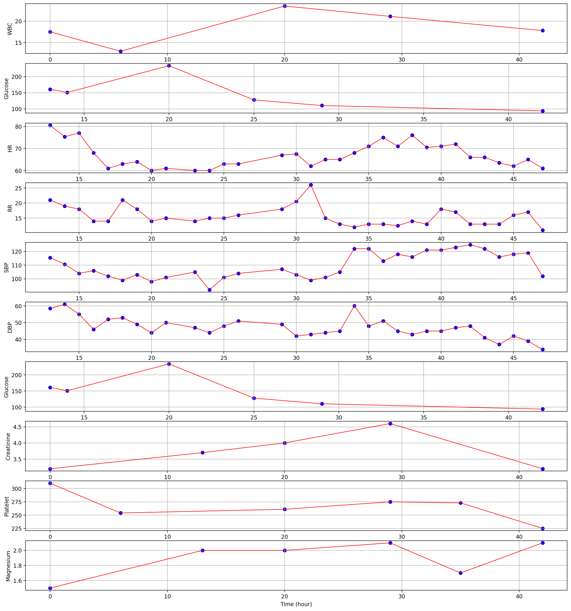

# Disease Prediction based on Clinical Time Series Data
## DATA
**Property**
* Irregularity
	* Non-uniform sampled-----x axis
	* The time interval is varying between time points 
	* The sampling density changes over different time periods

* Multple Variates 
	* HR(heartrate),Glucose...-----y axis

    

**Figure.1** The illustration of one clinical time series sample (collected from the first 48 hours into ICU)

## Related Works

## Package
* Python ([学习网站](https://www.runoob.com/python3/python3-install.html))
	* 可以动手在自己的PC上配置环境，并且编写代码
* Pytorch ([学习材料](https://github.com/xiaotudui/pytorch-tutorial))
	* 目前暂时不需要动手，只是学习编程语言即可

## Learning Material: 
* Dive into Deep Learning 动手学深度学习 ([官网](https://d2l.ai/))
* Machine Learning Courses from Hung-yi Lee 通俗易懂的深度学习课程
	* Video([学习视频](https://www.bilibili.com/video/BV1NX4y1r7nP/?spm_id_from=333.337.search-card.all.click))
	* PDF ([官网](https://speech.ee.ntu.edu.tw/~hylee/ml/2023-spring.php))

